# SOA Final project: Real-Time Scheduler Simulator
Made by Jaime Pablo Pérez Moro and Anabel Díaz Labrador.

# Description
In this project we have programmed a real-time scheduler simulator inspired by Cheddar.
We have used QT creator to make this project.
This simulation will be done using Rate-monotonic scheduling.

## QT Creator
We have worked on version 6.0.2 although it can possibly run on version 5.

# FCheddar v0.1
Fcheddar is a simple schedule simulator that provides plannability information on a given project created by the user.

# Usage
When you first open **FCheddar** there are no open projects nor database created, the program consists of two tabs. One tab is dedicated to the scheduler simulator and the other contains the database interface.

## Simulation Usage
First of all a project has to be created, this is done by clicking on the **new project** button shown in the following screenshot.

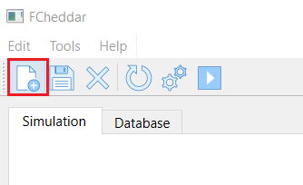

The following window will pop up

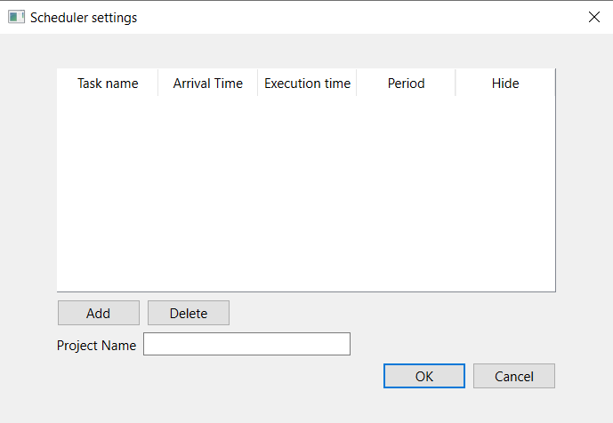

Freely add or delete tasks to the project by clicking on the add button or delete button respectively under the task table.

Each task will need the following information:
 - Task name.
 - Task execution time.
 - Task period
 - Task arrival time (0 by default, this value can be changed but in the current version we decided it would be better for it to stay unchanged.)
 - Hide task checkbox (Tick this checkbox to hide task)
> In future versions of FCheddar the idea is to be able to re-plan the project if a task is hidden.

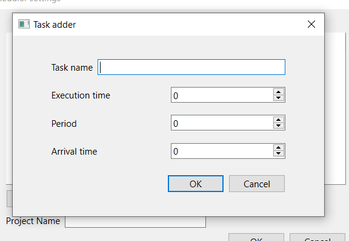
 
Once all of required information for a task has been introduced and is accepted the task is included into the table but no changes are made in the project yet, a name must be given to the project before being able to continue.

After this a new project is created, hyperperiod is calculated for the current project and tasks are shown in the simulations tab graph.

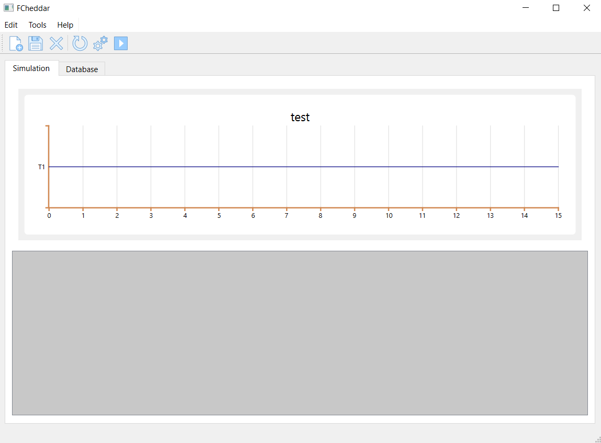

To run the simulation for the current project click on the **run button** from the toolbar at the top of the window.

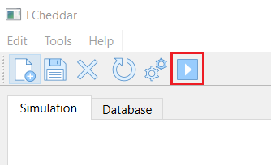

The simulation will run, painting with a different colour line on top of the base line for a task when that task is running. This will only happen if the current project is plannable, if its not, no graph will be shown and it will be notified to the user.

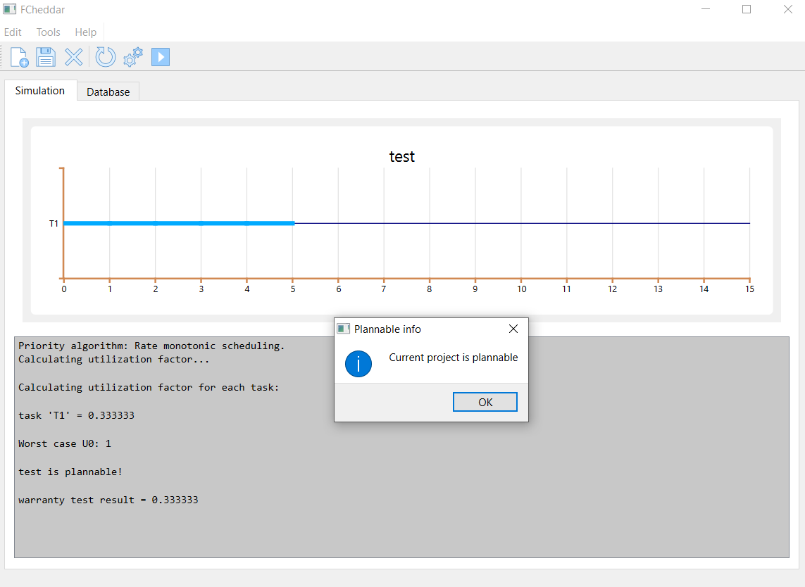

Additionally, information about the simulation will be displayed on the console under the space for the graph. This information is displayed using the algorithms explained ahead.

To edit the current project click on **scheduler settings button** and the project settings, set when creating the project, will be displayed.

To restart the simulation click on the **refresh button** and click on run **button again**.

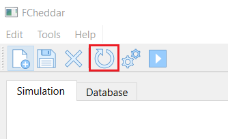

To close the current project click on the **close button** (**WARNING:** if the current project is not previusly saved on the database all data will be lost.)

To save the current project in a database (Having opened or created one before doing so) click on the save project button. This will automatically insert
the current project into the database.

To change the graphs aspect go to *Edit-->Window Settings*. A new window will appear
letting the user customize **base line colour for tasks**, **active line colour for tasks** and the **separation between ticks in the x-axis** for the graph. All of this information will be saved even if the program is closed.

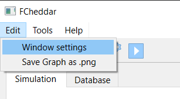

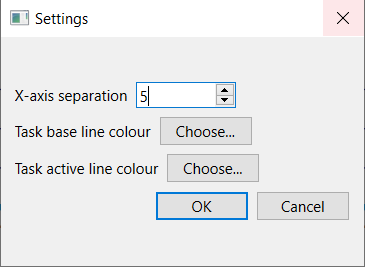

The current projects graph may be exported as **.PNG**.
To do this go to *Edit-->Save graph as .png* and a window to select the folder where the image will be stored at will appear. 

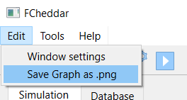

> In future versions of FCheddar we would like to improve this option. The current versions allows the user to convert any graph into .png even if the simulation has not been ran before doing so, this feature is kind of useless currently.

## Database usage
The database corresponds to the entire database tab.
### New Database
To create a new database select the **new database button** and select where you want to save the database and its name.
### Open Database
to open the database select the **open database button** and select the database that you have saved locally.
### Delete row
To delete rows select the row to delete in the table and press the **delete button**.

### Database functionality
When trying to insert a row into the database table once created, if there is already a row with the same data as the one being inserted, in any column that is set to be UNIQUE, the old row is replaced. 

Here is an overview of what the database looks like.

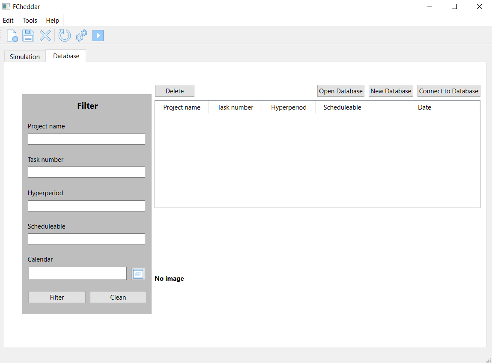

> In future versions of FCheddar it would be great to be able to let the user grab a desired project from the database and have it open up and ready to use
with the scheduler.

## TCP Server usage
To access the server options select: *Tools-->Server Database*. It should be noted that it is necessary to have an open database to be able to access this option. Once inside, there is a default server address and a server port that needs to be changed. For example, you could set the port number to 3000. When you click on **Start** the server will start working. If **Disconnect** is clicked, the server will shut down, so it will stop listening to the selected port and the client connected to the server will be automatically desconnected too.

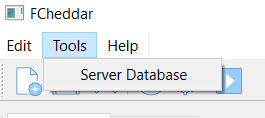

A window like the following will open:

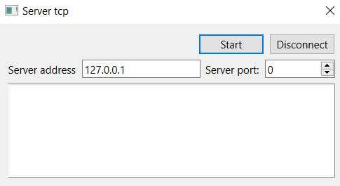

## TCP Client usage
To access the client options, go to *Connect to Database* in the database tab. To connect, you first need to know the port that a server is already listening on. Having the port, it must be placed in the port spinbox, since we are making a local connection, it is not necessary to change the server address. To finish we select the button to connect. to disconnect simply click the disconnect button. 

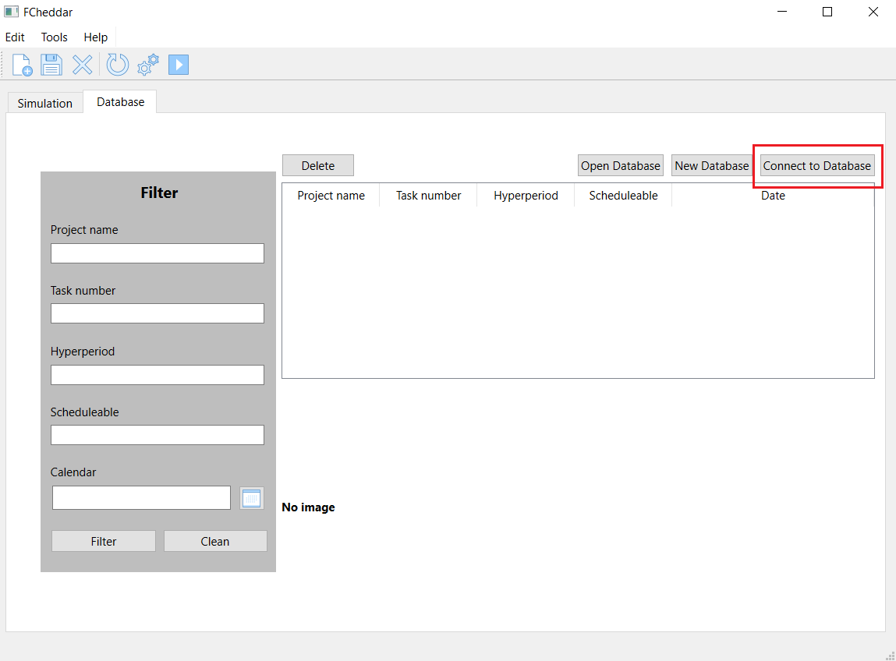

A window like the following will open:

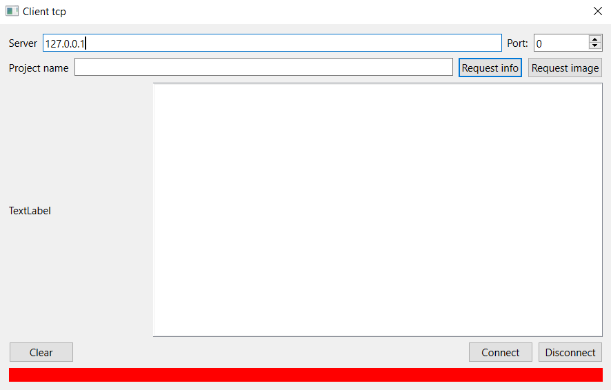

There are 2 different types of request:
 - **Text:** the information stored in the database of the requested project will be requested.
 - **Image:** the image stored in the database of the requested project will be requested.
 
 To use the requests it is necessary to know that the server contains the requested project.

 > In future versions of FCheddar we would like to be able to insert into an open/new database the information recieved from the TCP server.
 
 > It would also be good to add the posibility to send a request to the TCP server so that it sends all of the project names that it currently has.

## Algorithms used for the simulation
All algorithms used were programed specifically for **RMS (*Rate Monotonic Scheduling*)** 
When running the simulations, two algorithms are used to determine the projects plannability.

 - Usability Factor

$U_i = C_i/T_i$

This is used to calculate the usability factor for each task, the values are then compared with the worst case $U_0$ which is calculated using the following equation:
$U_0 = N(2^{1/N} - 1)$ (N being the number of tasks).

If all tasks have a $U_i <U_0$ the project is plannable, if any of them has a $U_i >= 1$ then it is not plannable and if any of the tasks is in the range $U_0 < U_i < 1$ then it is unclear if the project will be plannable or not.

 - TDA (Time  Demand  Analysis)

As said before, usability factor is not enough to determine plannability in some cases, that is why TDA is used. This iterative algorithm is able to determine plannability in a precise way. The calculations are done following this simple formula:

$W_n^i=Ci+(\sum_{j}^{u}p[u^{i-1}u/Tj]Cj) <=  (Di=Ti)$

where i is the iteration, n is the task number and j iterates from n-1.

